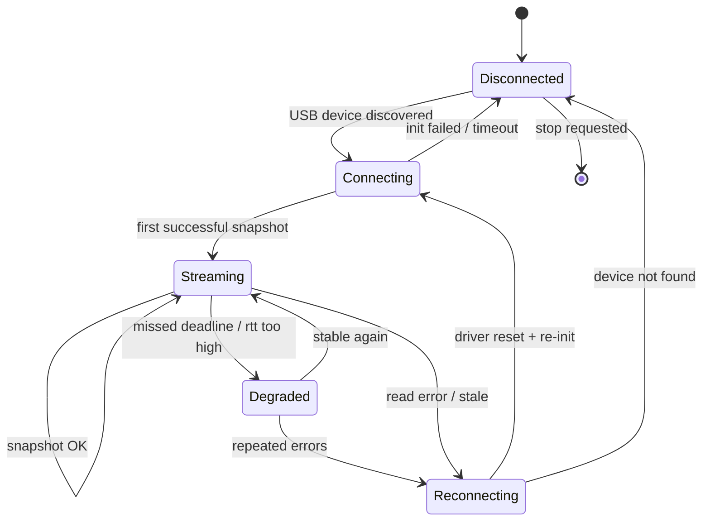
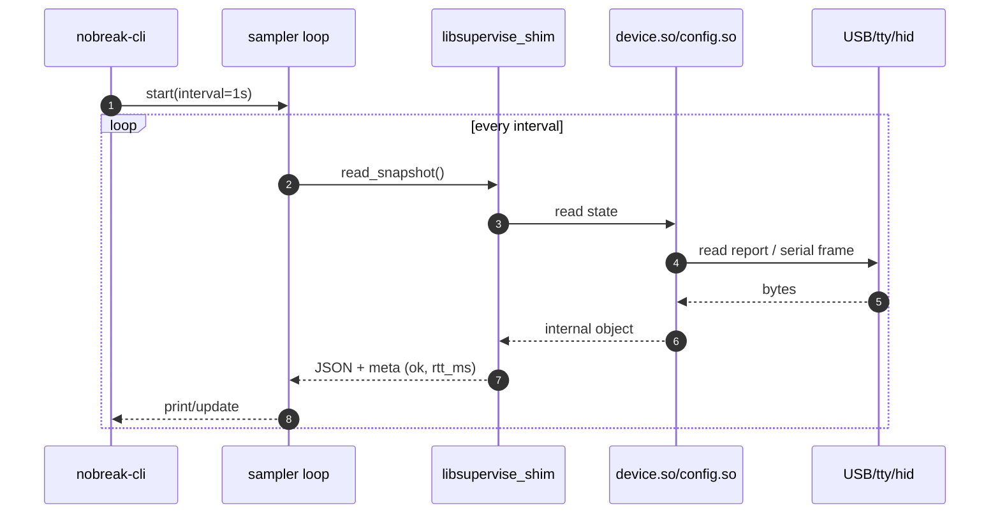

# Nobreak RagTech 3200VA — Realtime Monitor (CLI‑first) — Ultraspec

> **Mission:** replace the brittle “Supervise” monitoring experience with a **24/7, second‑by‑second** monitor that **never silently stalls**, **never lies about freshness**, and **never changes device state** (read‑only).
>
> **Scope (this phase):** **one device only** — *Nobreak RagTech 3200VA* — connected to a Linux server via USB. Output is a **CLI** (human + JSON mode) designed to evolve into a web app later.

---

## 0) Why this exists (deconstructing assumptions)

### The actual problem
“Monitoring” is not a UI problem. It’s a *truth* problem.

The current stack can show **old values** while the device is already disconnected, and can go **minutes without updating**. That is catastrophic because:
- if the data isn’t fresh, the operator can’t trust it;
- if disconnections aren’t detected quickly, automation (shutdowns, alerts) becomes guesswork;
- a monitor that is not *real‑time* becomes a *report*.

### The core friction (what’s broken)
The existing app is a **web UI** that **polls** a backend every ~3 seconds, and that backend itself can stall (for reasons we can’t fix without source). This is “lazy by design” and has no freshness guarantees.

### The elegant solution
A monitor that is correct must:
1. **own the sampling loop** (one heartbeat to rule them all),
2. **make freshness explicit** (age_ms, last_ok_ts, stale state),
3. **treat connectivity as a state machine** (not a boolean),
4. **restart/repair itself** automatically (watchdog and reconnection logic),
5. **separate “driver” from “presentation”** (CLI today, web tomorrow).

---

## 1) What we have today (reverse‑engineered context)

### 1.1 The running system: `ghcr.io/tofoli/supervise:main`
This container is a repackaging of Ragtech’s “Supervise” installer:
- Dockerfile downloads `supervise-8.9-2.sh` from Ragtech and installs to `/opt/supervise/` and runs `/opt/supervise/supsvc`.
- Compose runs the container **privileged** and mounts USB bus devices.

**Relevant extracted artifacts**
- `/opt/supervise/supsvc` — main daemon (HTTP API + static web UI).
- `.so` libraries: `supapi.so`, `monit.so`, `device.so`, `config.so` (and others).
- Web UI: `extracted_supervise/supervise/web/*` (static HTML/JS/CSS).
- Protocol/config DSL: `extracted_supervise/supervise/devices.xml`.

### 1.2 How the current web app works (plain terms)
The UI is static HTML + jQuery. It refreshes by repeatedly calling REST endpoints on `supsvc`.

Example (device list page) — it polls every 3 seconds:

```js
$(document).ready(function() {
  getDetail();
  getShutdown();
  var refreshId = setInterval(function() {
    getDetail();
    getShutdown();
  }, 3000);
});
```

And the device list call is:

```js
$.ajax({
  url: '/mon/1.1/device',
  method: 'GET',
  dataType: 'json',
  success: function(json) {
    $.each(json.devices, function(idx, device) { ... })
  }
});
```

**Implication:** the UI is inherently not “real‑time” and cannot report sub‑second changes. More importantly, the UI has no strict notion of freshness; if the backend stalls, it can keep showing the last payload.

### 1.3 The backend layering (what talks to what)
The extracted notes describe `supsvc` as the primary daemon that:
- opens the device monitoring stack (USB HID / USB CDC / serial),
- exposes an HTTP API rooted at `/mon/1.1`,
- serves the static UI.

Under the hood:
- `monit.so` looks aligned with REST endpoints (device list, logs, config, actions).
- `supapi.so` exposes a smaller “front door” API (start/stop, get status, get device).
- `device.so` is the low‑level device engine (enumeration, ports, read/write).
- `config.so` parses `client.cfg`, `monit.cfg`, and **`devices.xml`**.

### 1.4 `devices.xml` is the real protocol spec
The top-level `<ports>` section describes physical transports:

```xml
<ports>
  <usb class="hid" vid="0425" pid="0301"/>
  <usb class="cdc" vid="04D8" pid="000A"/>
  <serial name="UsbSerial" baud="2560" timeout="100" init="1000"/>
  ...
</ports>
```

**Interpretation:**
- The UPS may appear as **HID** (hidraw) *and/or* **CDC/ACM serial** (`/dev/ttyACM*`), matching the community reports.
- Serial presets include a 2560 baud profile with 100 ms timeout, which is compatible with observed community scripts.

---

## 2) What we reuse vs what we throw away (ruthless simplification)

### 2.1 Reuse (high leverage)
1. **`device.so`** — device enumeration + low-level USB/serial/hid I/O.
2. **`config.so` + `devices.xml`** — the device capability/range/var logic model (“DSL”).
3. **Existing JSON shapes** implied by `/mon/1.1/device` and `/mon/1.1/device/{id}` pages (because they already reflect meaningful UX semantics).

### 2.2 Keep as a *reference*, not as runtime
- **Web UI (`web/*`)**: invaluable for understanding schema + expectations, but not part of the new runtime.
- **`supsvc`**: useful as a baseline oracle (“what does Ragtech think the values should be?”) during validation.

### 2.3 Obsolete for this phase (cut)
- `cloudsvc`, `notifysvc`, `notifygui`, `shutsvc`: not needed for “read-only realtime state”.
- All action endpoints (shutdown, LED, etc.): explicitly out-of-scope.
- The internal web server: we will not inherit its stale-data failure modes.

---

## 3) The target product (what we are building)

### 3.1 One sentence
A **CLI-first** daemon that:
- **discovers** the RagTech UPS via USB,
- **connects** and **samples** state at a controlled cadence,
- **never hides staleness**,
- **self-heals** disconnections,
- outputs state as **human TUI** and **machine JSON**.

### 3.2 Non-goals (this phase)
- No device control or configuration changes.
- No multi-device support.
- No historical log storage (we’ll print stream data; storage can be done by external tools).
- No web UI (future phase only).

---

## 4) Architecture: why this is the only design that makes sense

The key decision: **split the system into two layers**.

1. **Driver layer**: “talk to the UPS and return a state snapshot”.
2. **Supervisor/CLI layer**: “schedule reads, enforce freshness, reconnect, present output”.

This separation is what eliminates “minutes of disconnection” as a silent failure. If the driver stalls, the supervisor sees it immediately and repairs it.

### 4.1 Proposed component diagram

```mermaid
flowchart LR
  subgraph Existing Supervise (reference)
    UI[Static Web UI<br/>polls every 3s] -->|HTTP /mon/1.1| SUPSVC[supsvc]
    SUPSVC --> MONIT[monit.so]
    MONIT --> DEVICE[device.so]
    DEVICE --> USB[(USB HID / CDC / Serial)]
  end

  subgraph New Realtime Monitor (this project)
    CLI[nobreak-cli] --> CORE[nobreak-core]
    CORE --> SHIM[libsupervise_shim.so<br/>(C++ thin wrapper)]
    SHIM --> DEVICE2[device.so + config.so]
    DEVICE2 --> USB2[(USB HID / CDC / Serial)]
  end
```

### 4.2 Why a C++ shim is mandatory (and beautiful)
The proprietary libraries are C++ and use C++ ABI types (`std::string`, class methods like `mcl::Object::toStr()`), but they **also expose C entrypoints** (`openDeviceManager`, `getDeviceList`, etc.) with unknown signatures.

A *shim* gives us:
- a **stable C ABI** we control,
- safe conversion of internal C++ objects to `char*` JSON,
- isolation from C++ memory ownership rules,
- an integration surface that Rust/Go/Python can call safely.

**This is the simplest path** that still reuses the vendor’s hard work: all the device decoding is already there.

---

## 5) Driver strategy (read-only, realtime)

We implement two drivers, ordered by preference:

### Driver A (preferred): **Vendor engine via shim**
- Use `device.so` (and `config.so`) to enumerate and read state.
- Expose one simple call: `read_snapshot()` that returns JSON + metadata (age, device id).
- The shim never calls action functions.

**Why this first:** it minimizes protocol risk while maximizing reuse.

### Driver B (fallback): **Direct CDC serial polling (community protocol)**
Community scripts show the UPS can respond to a serial request command:

- `REQUEST_COMMAND = AA0400801E9E`
- They `sleep(2)` before reading a 64-byte response.
- Node-RED examples poll every 5 seconds.

This fallback exists because:
- it bypasses the vendor engine completely,
- it may be simpler to control timing (one request = one response),
- it gives us a direct route to “1Hz if possible” by measuring the device’s round-trip time.

> We will only implement Driver B if Driver A cannot guarantee freshness (e.g., vendor engine caches internally or stalls without a way to force refresh).

---

## 6) The heartbeat: sampling, freshness, and reconnection

### 6.1 Sampling contract (the “truth guarantee”)
A snapshot is valid only if it satisfies:
- produced by a completed read cycle,
- timestamped with monotonic and wall clock,
- includes `age_ms` and `stale` boolean.

Definitions:
- `sample_interval_ms` (default **1000 ms**, configurable)
- `stale_after_ms` (default **2500 ms**): if we haven’t produced a sample within this window, state becomes stale.
- `disconnected_after_ms` (default **5000 ms**): if no successful read within this window, device is “disconnected” and we re-init the driver.

### 6.2 Confirming “how fast can we read?”
We do not guess. We **measure**.

Each read cycle measures:
- `rtt_ms` = time from “request” to “snapshot built”.
- `success_rate` over a rolling window.

Then we adapt:
- if `rtt_ms > 0.8 * sample_interval_ms` for N consecutive reads, increase interval.
- if timeouts occur, back off exponentially.
- if stable for 5 minutes, cautiously reduce interval (down to a configured minimum).

This auto-tuning is the key to “1 second if possible” without frying the bus or overloading the device.

### 6.3 State machine (connection is not a boolean)



### 6.4 Sample tick sequence



---

## 7) External interface (CLI now, web later)

### 7.1 CLI modes
1. **Human mode (default)**  
   Single-screen refresh (like `top`), showing:
   - connected / stale / last_ok
   - main electrical metrics
   - failures/status flags
2. **JSON stream mode** (`--json`)  
   Emits one JSON object per sample (stdout), suitable for piping to:
   - Prometheus exporters
   - Loki
   - custom log collectors
3. **Probe mode** (`--probe`)  
   Lists detected devices and raw transport info (VID/PID, /dev node).

### 7.2 Snapshot JSON schema (contract)
We will standardize on a stable schema from day 1 (so future web UI is trivial):

```json
{
  "ts": "2026-02-15T12:34:56.789Z",
  "mono_ms": 123456789,
  "device": {
    "id": "…",
    "model": "RagTech 3200VA",
    "transport": {"type":"cdc|hid", "path":"/dev/ttyACM0", "vid":"04D8", "pid":"000A"},
    "connected": true
  },
  "freshness": {
    "rtt_ms": 142,
    "age_ms": 0,
    "stale": false,
    "last_ok_ts": "…"
  },
  "status": {
    "code": "OL|OB|LB|…",
    "failures": [/* ints or strings */]
  },
  "vars": {
    "vInput": 127.0,
    "vOutput": 120.0,
    "fOutput": 60.0,
    "pOutput": 35,
    "vBattery": 24.8,
    "cBattery": 82,
    "temperature": 31
  }
}
```

Notes:
- `vars` is the “everything we can read” bucket. For this phase we require at minimum the set the original UI displays, and we expand as discovered.
- `status.code` should map to meaningful human states; for vendor-engine mode we preserve what it returns.

---

## 8) Implementation plan (phased, but no wasted work)

### Phase 0 — Baseline oracle (1 day)
Goal: establish a ground truth and a schema reference.

- Run the existing container.
- Write a tiny script (curl loop) that calls:
  - `GET /mon/1.1/device` (device list)
  - `GET /mon/1.1/device/{id}` (details)
  at 1Hz and log responses.
- Measure:
  - whether the detail payload contains a timestamp or changes every call
  - how often values actually change
  - whether stale periods happen and what the API returns during them

Deliverable: `baseline.jsonl` + notes on update behavior.

### Phase 1 — Build the shim (2–3 days)
Goal: make the vendor engine callable as a safe, stable C ABI.

**`libsupervise_shim.so` responsibilities**
- `int shim_init(const char* root_dir)`  
  loads config paths, initializes device manager, starts threads if needed.
- `int shim_discover(char** out_json)`  
  returns device list JSON (or simplified list).
- `int shim_read_snapshot(const char* device_id, char** out_json)`  
  returns device snapshot JSON (and includes freshness fields).
- `void shim_free(char* p)`  
  frees memory returned by shim.

Rules:
- Shim never calls write/action APIs.
- All returned strings are allocated with `malloc` and must be freed by `shim_free`.

Shim internals:
- use `dlopen`/`dlsym` against `device.so` / `config.so` (or link at build time).
- convert C++ objects to strings via vendor `mcl::Object::toStr()` (in C++).
- guard against exceptions; on exception, capture to last_error string.

Deliverable: `libsupervise_shim.so` + `shim.h` + a C test harness.

### Phase 2 — CLI (Rust) + state machine (2–4 days)
Goal: realtime CLI that never lies.

Rust crate layout:
- `nobreak-core`:
  - sampler loop (tokio or std thread)
  - state machine + reconnection policy
  - snapshot schema + JSON output
- `nobreak-cli`:
  - clap args
  - TUI rendering (optional; start with simple redraw)
  - JSON lines output

Key behaviors:
- 1Hz schedule using monotonic clock, no drift accumulation.
- one inflight read max (skip tick if previous read hasn’t finished).
- stale detection, reconnect, exponential backoff with jitter.
- metrics counters for:
  - reads_ok / reads_err
  - reconnects
  - max_age_ms seen

Deliverable: `nobreak-cli` binary.

### Phase 3 — 24/7 service hardening (2 days)
Goal: it runs forever.

- Systemd unit file with restart policy.
- udev rules for device permission stability.
- log rotation / journald integration.
- optional `--healthcheck` mode for container environments.

Deliverable: `systemd/nobreakd.service` + deployment doc.

---

## 9) Validation (how we know it’s correct)

### 9.1 Correctness invariants
- **Freshness invariant:** if output says `stale=false`, `age_ms <= stale_after_ms`.
- **No silent stalls:** if sampling stalls, CLI must switch to `stale=true` within `stale_after_ms`.
- **Read-only invariant:** no writes are issued (verified by:
  - code audit of shim exports used,
  - optional USB capture during soak tests).

### 9.2 Cross-check with Supervise
During development we keep `supsvc` running (same machine) as an oracle:
- Compare key vars (`vInput`, `vOutput`, `cBattery`, etc.) across both.
- Diff should be within tolerance (integer rounding or scaling).

### 9.3 Soak test
Run for 24 hours:
- record sample_count, max_gap_ms, reconnect_count
- ensure no memory growth (RSS stable)
- simulate unplug/replug events

---

## 10) Risks & mitigations (edge cases obsessed)

### Risk: Vendor engine caches internally (not truly realtime)
Mitigation:
- detect by checking whether a timestamp/sequence changes each tick.
- if not, implement Driver B (direct serial polling) for true “request → response” timing control.

### Risk: Unknown C ABI signatures cause crashes
Mitigation:
- keep shim in C++ and link directly to libraries, avoiding incorrect FFI from Rust.
- start by wrapping the minimal paths and validate with a C harness.

### Risk: USB permissions / device node changes break monitoring
Mitigation:
- ship udev rules; detect and log permission errors explicitly.
- treat “permission denied” as a first-class disconnected reason.

### Risk: Polling too fast overwhelms the device
Mitigation:
- auto-tune interval by measured RTT.
- enforce minimum interval boundaries.
- single inflight request.

---

## Appendix A — What the `.so` exports tell us (why reuse is viable)

The extracted export lists show the vendor libraries already have the operations we need.

**`device.so`** exports (selected):
- lifecycle: `openDeviceManager`, `start`, `stop`, `isRunning`
- read: `getDeviceList`, `getDevice`, `getDevicesCount`
- discovery: `discoveryStatus`

**`monit.so`** exports (selected):
- read: `getDeviceList`, `getDevice`, `getDevicesCount`
- logs: `deviceLogHour`, `deviceLogDay`, ...
- actions/config: many (out of scope)

**`supapi.so`** exports (selected):
- `Start`, `Stop`, `GetStatus`, `GetDevice`, `GetSuperviseLastError`

These names strongly suggest the read path already exists; our job is to **wrap it safely**, **schedule it correctly**, and **expose freshness**.

---

## Appendix B — Minimum metric set (for future web/dashboard)
Even with “CLI only”, we should bake in metrics now:

- `nobreak_connected{}` = 0/1
- `nobreak_stale{}` = 0/1
- `nobreak_age_ms{}` gauge
- `nobreak_rtt_ms{}` gauge
- `nobreak_reads_total{result="ok|err"}`
- `nobreak_reconnects_total{}`

These will make the future web app almost trivial: it will just read from an already-correct core.

---

## Appendix C — “Second-by-second” reality check (what we can confirm today)
Community evidence for Ragtech serial monitoring shows:
- a request frame `AA0400801E9E`,
- a `sleep(2)` before reading a 64-byte response,
- practical polling every 5 seconds in Node-RED examples.

This implies **1Hz may or may not be feasible** depending on the device’s response latency.
Therefore, our spec treats “1Hz” as a **goal** achieved via measurement + auto-tuning, not a hardcoded assumption.

